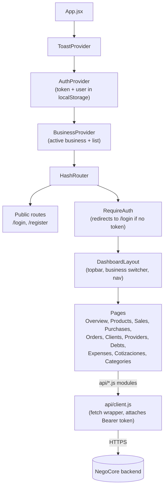
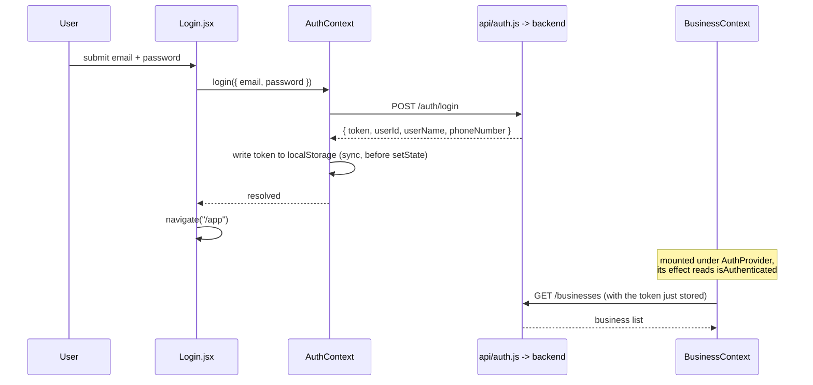

# NegoCore — Frontend

A React single-page app for small-business management: catalog, clients and
providers, sales, purchases, orders, debts/payables, expenses, quotes and a
balance overview. Talks to the [NegoCore backend](https://github.com/Jhonmario8/NegoCore-Backend)
over a plain REST API with a JWT bearer token.

- **Live app**: https://nego-core-frontend.vercel.app
- **Backend / API**: https://negocore-backend.onrender.com

> The backend runs on a free-tier host that spins down when idle, so the
> first login after a while can take up to ~1 minute — the login screen
> shows a notice about this so it doesn't read as a broken app.

## Tech stack

| Concern | Choice |
|---|---|
| Framework | React 19 |
| Routing | react-router-dom 7, `HashRouter` (works on a static host with no server-side rewrite rules) |
| Build tool | Vite 8 |
| Linting | oxlint |
| State | React Context (no Redux/Zustand) — `AuthContext`, `BusinessContext`, `ToastContext` |
| Styling | Plain CSS with custom properties (design tokens), no CSS framework |
| Image export | `html-to-image` — renders a sale/purchase receipt or a quote as a downloadable PNG |
| CI | GitHub Actions (lint + build) |

There is currently no test runner configured (no Vitest/Jest/RTL) — see
"Known limitations" below.

## Architecture



Every domain area has its own thin API module under `src/api/` (`catalog.js`,
`crm.js`, `sales.js`, `purchases.js`, `orders.js`, `quotes.js`, `finance.js`,
`auth.js`, `business.js`) — all of them go through the shared `api` helper in
`api/client.js`, which centralizes the base URL, the `Authorization` header,
and turning a non-2xx response into a thrown `ApiError`.

### Auth flow



The token and user are persisted to `localStorage` (`negocore_token`,
`negocore_user`); `AuthContext.login` writes the token synchronously (not
only through its `useEffect`) so that `BusinessContext`'s effect — which
fires in the same commit — already sees it when it fetches the business
list. `RequireAuth` simply checks `isAuthenticated` (whether a token is
present) and redirects to `/login` otherwise; there's no token expiry check
on the client, so an expired token is only discovered when a request comes
back 401/expired from the backend.

## Getting started

### Prerequisites

- Node.js `^20.19.0` or `>=22.12.0` (required by Vite 8)
- A running instance of the [NegoCore backend](https://github.com/Jhonmario8/NegoCore-Backend)

### Setup

```bash
npm install
cp .env.example .env   # edit VITE_API_URL if your backend isn't on localhost:8080
npm run dev
```

### Environment variables

| Variable | Required | Description |
|---|---|---|
| `VITE_API_URL` | no | Base URL of the backend API. Defaults to `http://localhost:8080` if unset. |

### Scripts

| Command | Description |
|---|---|
| `npm run dev` | Start the Vite dev server |
| `npm run build` | Production build to `dist/` |
| `npm run preview` | Preview the production build locally |
| `npm run lint` | Run oxlint |

## CI

[`.github/workflows/ci.yml`](.github/workflows/ci.yml) runs `npm ci`,
`npm run lint` and `npm run build` on every push and pull request to `main`.

## Known limitations / possible next steps

Written honestly, not as a to-do list to impress — these are real gaps:

- **No automated tests.** No Vitest/Jest/React Testing Library is set up;
  correctness today relies on manual testing and the backend's own test
  suite. CI only lints and builds.
- **`AuthContext`, `BusinessContext` and `ToastContext` each export both a
  provider component and a hook/constant from the same file**, which
  disables Vite's Fast Refresh for those files (flagged by oxlint's
  `react/only-export-components` rule) — splitting the hook into its own
  file would fix it, not done yet to avoid touching working files without a
  concrete need.
- **No client-side token expiry handling.** A stale token isn't detected
  until a request actually fails; there's no proactive redirect to `/login`
  when the JWT's 10-hour window has passed.
- **No pagination in the UI** for lists that can grow (products, sales,
  purchases, clients) — this mirrors the backend, which also doesn't
  paginate those endpoints yet.
- **The backend's audit log endpoint has no page here** — it exists and
  works, but nothing in this app surfaces it yet.
- **No offline/retry handling** beyond the single cold-start notice on the
  login screen — a mid-session network blip surfaces as a raw error toast.
