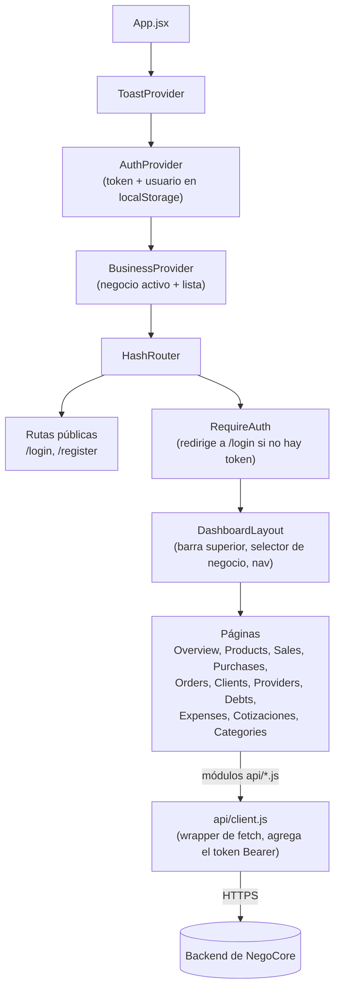
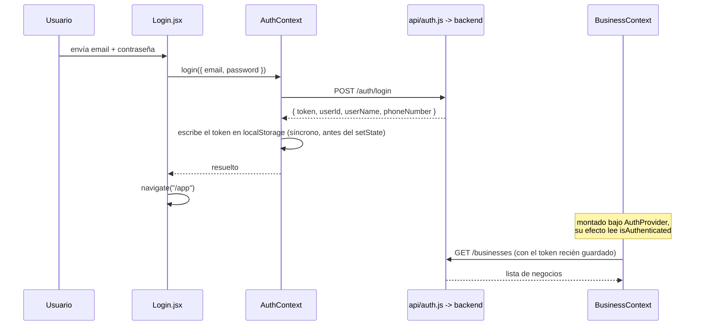

# NegoCore — Frontend

Una aplicación de una sola página (SPA) en React para gestión de pequeños
negocios: catálogo, clientes y proveedores, ventas, compras, pedidos,
deudas/cuentas por pagar, gastos, cotizaciones y un resumen de balance. Habla
con el [backend de NegoCore](https://github.com/Jhonmario8/NegoCore-Backend)
a través de una API REST simple con token JWT.

- **App en vivo**: https://nego-core-frontend.vercel.app
- **Backend / API**: https://negocore-backend.onrender.com

> El backend corre en un host de plan gratuito que se apaga cuando está
> inactivo, así que el primer login después de un rato puede tardar hasta
> ~1 minuto — la pantalla de login muestra un aviso sobre esto para que no
> parezca una app rota.

## Stack tecnológico

| Aspecto | Elección |
|---|---|
| Framework | React 19 |
| Enrutamiento | react-router-dom 7, `HashRouter` (funciona en un host estático sin reglas de reescritura del lado del servidor) |
| Herramienta de build | Vite 8 |
| Linting | oxlint |
| Estado | React Context (sin Redux/Zustand) — `AuthContext`, `BusinessContext`, `ToastContext` |
| Estilos | CSS plano con custom properties (design tokens), sin framework de CSS |
| Exportación de imágenes | `html-to-image` — renderiza un recibo de venta/compra o una cotización como PNG descargable |
| CI | GitHub Actions (lint + build) |

Actualmente no hay ningún test runner configurado (sin Vitest/Jest/RTL).

## Arquitectura



Cada área de dominio tiene su propio módulo delgado de API bajo `src/api/`
(`catalog.js`, `crm.js`, `sales.js`, `purchases.js`, `orders.js`,
`quotes.js`, `finance.js`, `auth.js`, `business.js`) — todos pasan por el
helper compartido `api` en `api/client.js`, que centraliza la URL base, el
header `Authorization`, y convierte una respuesta no-2xx en un `ApiError`
lanzado.

### Flujo de autenticación



El token y el usuario se persisten en `localStorage` (`negocore_token`,
`negocore_user`); `AuthContext.login` escribe el token de forma síncrona (no
solo a través de su `useEffect`) para que el efecto de `BusinessContext` —
que se dispara en el mismo commit — ya lo vea al pedir la lista de negocios.
`RequireAuth` simplemente verifica `isAuthenticated` (si hay un token
presente) y redirige a `/login` si no lo hay; no hay verificación de
expiración de token en el cliente, así que un token vencido solo se
descubre cuando una petición vuelve como 401/expirada desde el backend.

## Primeros pasos

### Requisitos previos

- Node.js `^20.19.0` o `>=22.12.0` (requerido por Vite 8)
- Una instancia en ejecución del [backend de NegoCore](https://github.com/Jhonmario8/NegoCore-Backend)

### Configuración inicial

```bash
npm install
cp .env.example .env   # edita VITE_API_URL si tu backend no está en localhost:8080
npm run dev
```

### Variables de entorno

| Variable | Requerida | Descripción |
|---|---|---|
| `VITE_API_URL` | no | URL base de la API del backend. Por defecto `http://localhost:8080` si no se define. |

### Scripts

| Comando | Descripción |
|---|---|
| `npm run dev` | Inicia el servidor de desarrollo de Vite |
| `npm run build` | Build de producción en `dist/` |
| `npm run preview` | Previsualiza el build de producción localmente |
| `npm run lint` | Corre oxlint |

## CI

[`.github/workflows/ci.yml`](.github/workflows/ci.yml) corre `npm ci`,
`npm run lint` y `npm run build` en cada push y pull request a `main`.
